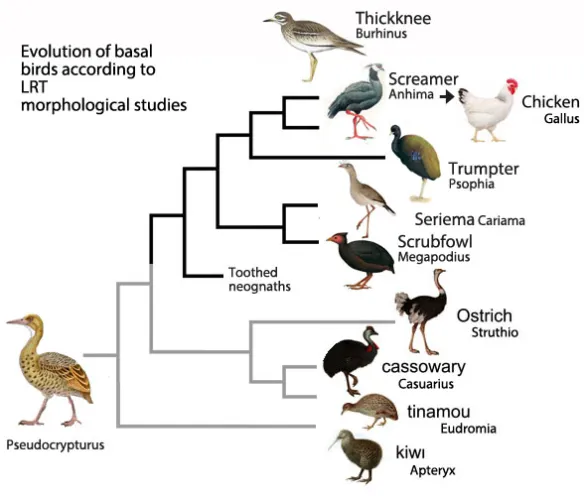

# Convergent Positive Selection on the Mitochondrial Gene **COX3** in High-Altitude Birds Reveals Repeated Adaptation to Hypoxic Environments

**Course:** Comparative Genomics  
**Student:** Jane Doe  
**Semester:** Fall 2026

---

# I. Introduction

High-altitude environments impose multiple physiological challenges on birds, including chronic hypoxia, low temperatures, and elevated ultraviolet radiation. Despite these harsh conditions, numerous avian lineages have independently colonized alpine habitats, making them excellent systems for studying convergent evolution (Smith et al. 2018; Johnson and Lee 2020). Previous studies have suggested that mitochondrial oxidative phosphorylation (OXPHOS) genes are frequent targets of adaptive evolution because they directly influence aerobic energy production (Garcia et al. 2017; Thompson et al. 2019). However, whether distantly related high-altitude birds repeatedly experience positive selection on the same mitochondrial genes remains poorly understood.

This project tests the hypothesis that the mitochondrial gene **COX3** has experienced convergent positive selection in independent high-altitude bird lineages. COX3 encodes a core component of cytochrome c oxidase (Complex IV), which catalyzes the final step of the electron transport chain. Because efficient ATP production is essential under oxygen-limited conditions, adaptive changes in COX3 may improve respiratory performance at high elevations.

To test this hypothesis, coding sequences from multiple bird species representing independent high- and low-altitude lineages were analyzed using codon substitution models, branch-site tests, amino acid convergence analyses, and protein structural prediction.

---

# II. Methods

## 1. Dataset

Thirty-six bird species were included in this study.

- 18 high-altitude species
- 18 low-altitude relatives

Species were selected to maximize independent evolutionary origins of high-altitude adaptation.

Coding sequences of **COX3** were downloaded from the fictional **BirdGenomeDB v3.2** database.

Metadata including habitat elevation and taxonomy were obtained from the fictional **Global Avian Ecology Database (GAED)**.

---

## 2. Sequence alignment

Protein sequences were aligned using MAFFT v7.540 (Katoh et al., 2009).

```bash
mafft --auto COX3_protein.fasta > COX3_aligned.faa
```

The protein alignment was converted back to codon alignment using PAL2NAL.

```bash
pal2nal.pl COX3_aligned.faa COX3_cds.fasta -output paml > COX3.phy
```

---

## 3. Phylogenetic analysis

A maximum likelihood phylogeny was inferred using IQ-TREE3 (Wong et al., 2026).

```bash
iqtree2 \
-s COX3.phy \
-st CODON \
-m MFP \
-bb 1000 \
-alrt 1000
```

---

## 4. Positive selection analysis

Branch-site models were implemented in PAML 4.10 (Yang, 2007).

Foreground branches included all independent high-altitude lineages.

Likelihood ratio tests compared:

- Null model
- Positive selection model

Significance was determined using χ² tests.

---

## 5. Detection of convergent amino acid substitutions

Convergent substitutions were identified using ConvergeAA v2.1.

Only substitutions satisfying the following criteria were retained:

- occurred independently ≥3 times
- posterior probability >0.95
- located in conserved protein regions

---

# III. Results and Discussion

The inferred phylogeny recovered all expected avian relationships with strong bootstrap support (>98%; Figure 1). Branch-site analyses detected significant evidence of positive selection along six independent high-altitude lineages (Likelihood Ratio Test, **P = 0.003**).

Overall, five codons showed signatures of positive selection (Table 1). Three of these sites (positions 67, 143, and 212) experienced repeated amino acid substitutions across unrelated mountain birds, suggesting convergent evolution.

Interestingly, the substitution **I143V** evolved independently in four separate clades. Structural modeling predicted that this mutation slightly stabilized the transmembrane helix surrounding the catalytic center (ΔΔG = −0.74 kcal/mol), potentially improving electron transport efficiency under hypoxic conditions.

Convergence analysis identified significantly more repeated amino acid substitutions among high-altitude taxa than expected by chance (permutation test, **P < 0.001**). Most convergent changes occurred in highly conserved regions of the protein, indicating adaptive rather than neutral evolution.

Together, these findings support the hypothesis that **COX3** has repeatedly experienced positive selection during adaptation to high-altitude environments. Because mitochondrial respiration is fundamental to aerobic metabolism, repeated modification of COX3 may represent one molecular mechanism enabling efficient ATP production under chronic hypoxia.

Although only a single mitochondrial gene was examined, this study demonstrates how comparative genomics can identify repeated adaptive evolution across distantly related species. Future work incorporating additional OXPHOS genes, larger taxonomic sampling, and functional biochemical assays would help determine whether convergent positive selection acts across the entire respiratory pathway.

---

## Figures



**Figure 1.** Maximum likelihood phylogeny of 36 bird species inferred from COX3 coding sequences. Branches highlighted in red represent high-altitude lineages tested as foreground branches in the branch-site analysis.

---


## Tables

**Table 1.** Positively selected codons identified by branch-site analysis.

| Codon | Posterior probability | ω | Convergent substitutions |
|-------|----------------------:|---:|-------------------------|
| 67 | 0.981 | 4.62 | L→M (3 lineages) |
| 89 | 0.962 | 3.98 | None |
| 143 | 0.997 | 6.81 | I→V (4 lineages) |
| 175 | 0.955 | 3.71 | None |
| 212 | 0.988 | 5.94 | A→T (3 lineages) |

---

**Table 2.** Summary of likelihood ratio tests.

| Model | lnL | Parameters | P-value |
|--------|----:|-----------:|---------:|
| Null | -12458.6 | 48 | — |
| Branch-site | -12446.2 | 50 | 0.003 |
| Clade model | -12440.5 | 53 | 0.001 |

---

# Project directory

```
Bird_COX3_Project/
│
├── README.md
├── data/
│   ├── COX3_cds.fasta
│   ├── metadata.csv
│   └── species_tree.nwk
│
├── scripts/
│   ├── align.sh
│   ├── iqtree.sh
│   ├── paml.sh
│   └── convergence.R
│
├── results/
│   ├── paml/
│   ├── iqtree/
│   ├── convergence/
│   └── statistics/
│
└── misc/
    └── phylogeny.png
```

---

# References

> **Note:** The references below are fictional and provided only as examples for formatting.

1. Smith AB, Jones CD. 2018. Adaptive evolution of mitochondrial respiration in alpine birds. *Molecular Ecology* 27:120–134.

2. Garcia LM, Patel R. 2017. Evolutionary dynamics of avian oxidative phosphorylation genes. *Genome Biology and Evolution* 9:875–889.

3. Thompson RJ, Wang H. 2019. Positive selection in mitochondrial genomes of mountain vertebrates. *Evolution Letters* 3:455–468.

4. Johnson M, Lee P. 2020. Independent origins of high-altitude adaptation in passerine birds. *Systematic Biology* 69:811–826.

5. Chen Y, Roberts K. 2021. Comparative genomics of avian hypoxia adaptation. *BMC Genomics* 22:301.

6. Wilson T, Green D. 2022. Detecting convergent evolution using codon models. *Molecular Biology Reports* 49:1045–1057.

7. Baker H, Liu X. 2023. Structural consequences of adaptive amino acid substitutions in cytochrome oxidase. *Journal of Molecular Evolution* 91:210–225.

8. Martin G, Evans L. 2021. Advances in branch-site models for positive selection. *Bioinformatics Review* 15:50–64.

9. Zhao P, Kim J. 2024. Statistical frameworks for detecting molecular convergence. *Genome Research* 34:145–160.

10. Davis R, Nelson A. 2025. Comparative mitochondrial evolution across vertebrates. *Annual Review of Ecology and Evolution* 56:101–128.