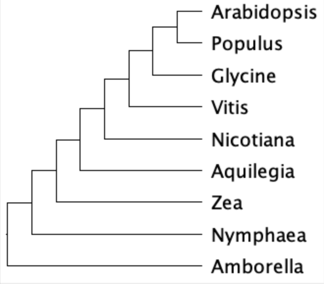

# Lab 1 homework: evolution of phytochrome in angiosperms

Use the following alignment `.fas` to build a phylogeny using IQ-TREE. Submit the phylogeny and log file. Answer the following questions.

1. View the alignment in AliView, how many sequences are there and what is the length of the alignment (1 pt)?

2. Infer a Maximum Likelihood phylogeny for this alignment, using the default ModelFinder to find the best substitution model and use 1500 Ultrafast bootstrap replicates to assess branch support. What command did you use? (1pt)

3. Attach the *.treefile and *.log file to this report (1 pt)

4. Based on the log file, what is the best-fitting substitution model selected by BIC (1 pt)?

5. View the *.treefile in FigTree. What is the ultrafast bootstrap support value for the common ancestor of `Amborella_AmTrH1.10G042500.1` and `Zea_GRMZM2G057935_T01` (1 pt)?

6. Given the following species tree, how would you root the phylogeny of the gene tree? Identify one ancient gene duplication and one recent gene duplication to explain the gene tree you get (1 pt)?

e.g., this gene tree can be explained by a gene duplication in the common ancestor of x and y, and gene losses in the common ancestor of z and w. Describe the precise nodes where the duplication and loss events occurred to get full credit.
