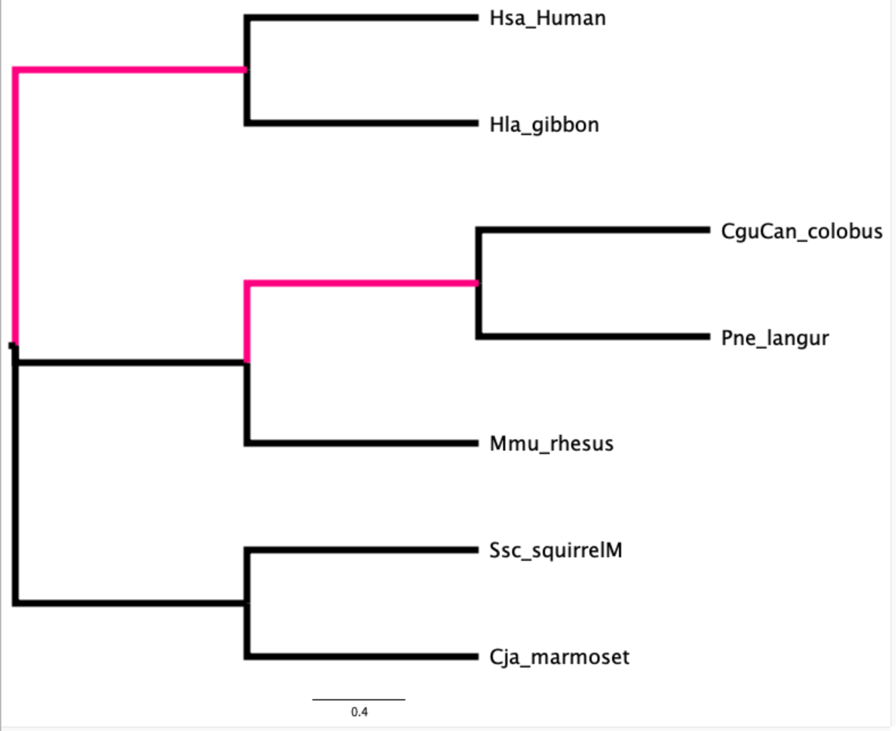

# Lab 1 homework: testing altered selection in lysozyme

## What to include for the submission?
1. A word/text file to answer the following questions.
2. The output from the branch model.

Zip the above documents into a single file, submit through the Canvas assignment page.
---------------------

Included is the lysozyme sequence alignment of seven primate species originally from Messier and Stewart (1997). The sequence alignment is provided in `lysozyme.phy` and the input phylogeny is provided in `lysozyme.tre`. Use the codeml control file lysozyme.ctl as the template to perform parameter estimation for a Homogeneous model (M0) and a branch model to test for positive selection.

1. For the M0 model, how would you set up the `model` and `NSsites` in `lysozyme.ctl` (1 pt)?

2. Set the output to be `M0.out.txt` (outfile = ###). Run CODEML analysis for the M0 model. What are the omega and log-likelihood estimated from this model? (1pt)

3. Lysozyme was adapted for digestive defense against bacteria in primates that evolved foregut fermentation. Therefore, we suspect positive selection in the two branches leading to the common ancestor of Hominoids and Colobines as pictured below. How would you label your phylogeny according to the following colored branch pattern (pink branches set as foreground) (1 pt)

 

[Self-check] The labeled phylogeny should be as follows:
```
7 1
((Hsa_Human,Hla_gibbon) #1,((CguCan_colobus,Pne_langur) #1,Mmu_rhesus),(Ssc_squirrelM,Cja_marmoset));

```

4. Modify the control file to run a branch model where foreground branches are under positive selection. How would you set up the `model` and `NSsites` parameters (1 pt)?

5. Set the output to be `branch.out.txt` (outfile = ###). Run CODEML analysis for the branch model. What are the omega values for the foreground and background, respectively (1 pt)?

6. Given the number of parameters in M0 and the branch model (np), their difference in log likelihood (LnL), perform a chi-square test in R or Excel. What is the p-value for the branch model and does the data support positive selection in Hominoids and Colobines (1 pt)?

